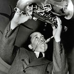
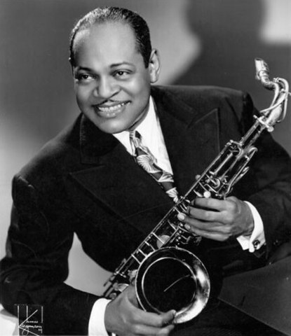
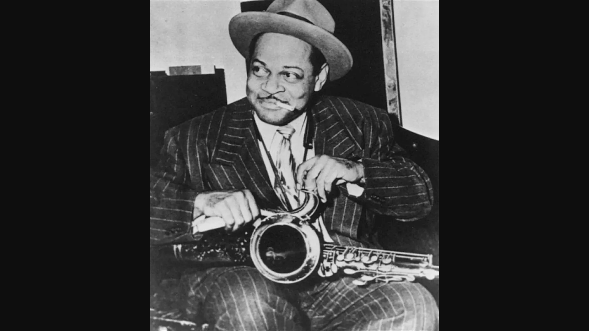

<!DOCTYPE html>
<html lang="en">

<head>
    <meta charset="UTF-8">
    <meta name="viewport" content="width=device-width, initial-scale=2.0">
    <title>Coleman Hawkins - Legendary Jazz Musician</title>
    <link href="css/style.css" type="text/css" rel="stylesheet" />
    <link rel="stylesheet" href="css/layout.css">
    <link rel="stylesheet" href="https://www.w3schools.com/w3css/4/w3.css">
    <link rel="icon" type="image/png" sizes="32x32" href="images/favicon-32x32.png">
</head>

<body>
    <nav class="topnav">
        

            <a class="active p3" href="index.html">Home</a>
        

        

            <a href="gallery.html" class="p3">Gallery</a>
        

        

            <a href="contact-us.html" class="p3">Contact</a>
        

        

            <a href="faq.html" class="p3">FAQ</a>
        

        

            <a href="about-us.html" class="p3">About Us</a>
        

        

            <a href="https://2learnwp.brookhavencollege.edu/ColemanHawkins/" class="p3">WordPress</a>
        

    </nav>
    <header>

        <h1>Welcome to the World of Coleman Hawkins</h1>
        
        <nav>

            

                <a href="#section1">Early Life</a>
            

            

                <a href="#section2">Career Highlights</a>
            

            

                <a href="#section3">Legacy and Influence</a>
            

        </nav>

    </header>

    <main>
        <section id="section1">
            <h2>.</h2>
            <button class="w3-btn">Early Life</button>

            
Hawkins was born in Saint Joseph, Missouri, United States,[6] in 1904. He was named Coleman after his
                mother's maiden name Cordelia. There is evidence that the Hawkins parents' first child, a girl, was born
                in 1901 and died at the age of two.

            
In his youth he played the piano and cello, and he began playing the saxophone at the age of nine. At the
                age of fourteen he was playing in Eastern Kansas.

            
He attended high school in Chicago, then in Topeka, Kansas at Topeka High School. He later claimed that
                he studied harmony and composition for two years at Washburn College in Topeka while still attending
                high school.

        </section>
        <article>
            <h2>.</h2>
            <section class="w3-container w3-card indexcard w3-sand">
                <h2>.</h2>
                <figure>
                    
                    <figcaption>Portrait of Coleman Hawkins</figcaption>
                </figure>
            </section>
        </article>
        <section id="section2">
            <h2>.</h2>
            <button class="w3-btn">Career Highlights</button>
            
Hawkins' first major gig was with Mamie Smith's Jazz Hounds in 1921, and he was with the band full-time
                from April 1922 until 1923, when he settled in New York City. In the Jazz Hounds he met Garvin Bushell,
                Everett Robbins, Bubber Miley and Herb Flemming.

            
Hawkins joined Fletcher Henderson's orchestra, where he remained until 1934, [6] sometimes doubling on
                clarinet and bass saxophone. Hawkins' playing changed significantly during Louis Armstrong's tenure with
                the Henderson Orchestra 1924 to 1925.

            
In the late 1920s, Hawkins participated in some of the first integrated recording sessions with the Mound
                City Blue Blowers. During his time with Henderson, he became a star solo artist with increasing
                prominence on records.

        </section>
        <article>
            <h2>.</h2>
            <section class="w3-container w3-card section2card w3-sand">
                <h2>-</h2>
                <figure>
                    
                    <figcaption> Coleman Hawkins</figcaption>
                </figure>
            </section>
        </article>
        <section id="section3">
            <h2>-</h2>
            <button class="w3-btn">Legacy and Influence</button>
            
Hawkins is known for his outstanding technique and virtuoso style on the tenor saxophone. He is credited
                with transforming the role of the saxophone within jazz by elevating it to a primary instrument and
                giving it new relevance. His innovative approach to improvisation, tone and expressiveness greatly
                influenced future generations of saxophonists.

            
In addition, Hawkins was one of the main precursors of modern jazz and the style known as "bebop." His
                playing paved the way for new developments in improvisation, harmony and rhythm within the genre. Many
                bebop musicians, such as Charlie Parker and Dizzy Gillespie, cited Hawkins as a major influence on him.
            

            
Another lasting legacy of Hawkins is his 1939 recording of the song "Body and Soul." This revolutionary
                saxophone solo is considered one of the best and most influential in jazz history. Hawkins used new
                melodic and harmonic techniques in his playing, pushing the boundaries of what was thought possible in
                improvised jazz. This recording became a standard of the genre and has been covered by countless artists
                over the years.

            
Overall, Coleman Hawkins' legacy lies in his technical virtuosity, his innovation in improvisation, and
                his influence on the development of jazz as a genre. His impact has transcended generations of musicians
                and his style continues to be studied and appreciated today.

        </section>
    </main>

</body>

</html>
